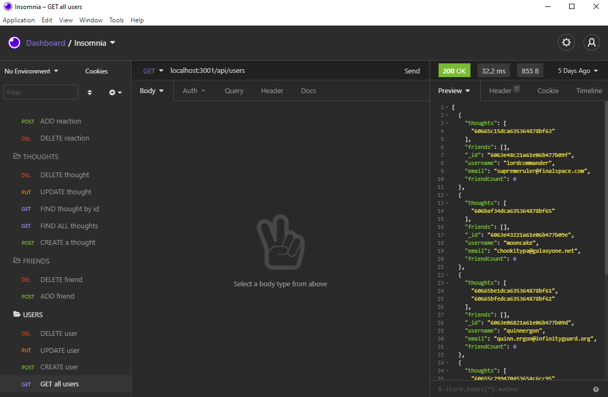

# Social Network API

## Description

A simple social network api built with Express.js, Mongoose, and NoSQL. Users can sign up, make friends, and share thoughts and reactions.

View a demo video [here](https://drive.google.com/file/d/1EWd5IsqSZN5q3KTD1vWVKY8-x3j6UXEW/view?usp=sharing).

## Table of Contents
* [Installation](#installation)
* [Usage](#usage)
* [Built With](#built-with)
* [Questions](#questions)

## Installation

* Clone repository
* Open command line and navigate to the root folder
* Install Node.js, Mongoose, and Express

## Usage

- The user should run "npm start" to deploy the server
- [Insomnia Core](https://insomnia.rest) is suggested to test the API endpoints
- 

## Built With

- JavaScript
- Node.js
- Express.js
- Mongo
- Mongoose

## Questions

Created by: [Kenny Larson](https://github.com/kenneththelarson)

For further question please contact [kenneththelarson@gmail.com](mailto:kenneththelarson@gmail.com)